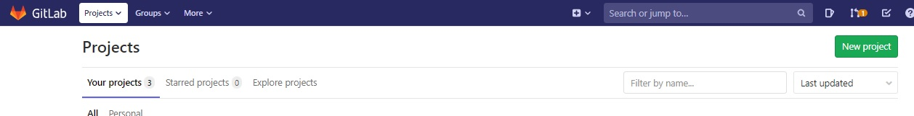
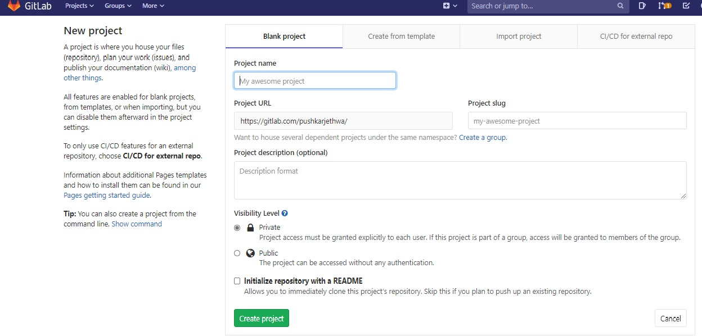
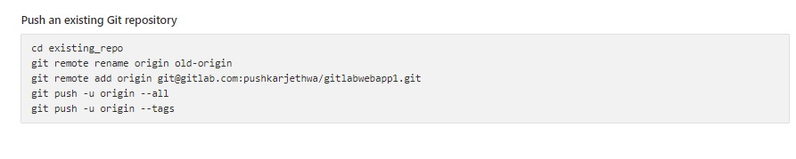

# **Getting Started with Git & Gitlab Project**

## **Setup Local Git**

## Task 1 :Setup Dotnet Core Project
---
- Create a Folder
- Open Command  Prompt at your path
- Run `dotnet new mvc --name GitLabWebApp --no-https`
- Run `cd GitLabWebApp`
- Run `dotnet new sln --name GitLab`
- RUn `dotnet sln add GitLabWebApp.csproj Gitlab.sln`


## Task 2 :Initialize Local Git Repository
---
### Run Commands in Terminal

- Initialize Git ` git init`
- Register Your Details on Git
```bash
     git config --global user.name <Enter Name>
     git config --global user.email <Enter Email>

``` 
 Note: _Use same email used to register on GitLab_       
- Stage all Changes `git add .`
- Commit Changes `git commit -m "Project Initialized"`


# **Working with Git Project in GitLab**

## Task 1 Setup GitLab Repo
---
- Login to GitLab Account
- Create New Project
  
    
- Enter Details
  
    


## Task 2: Connect Local Git with Remote Git
---
- Select GitLab Project > Overview
- Select _Push an existing repository_
- **Enter your Gitlab Credentials when asked**

    

