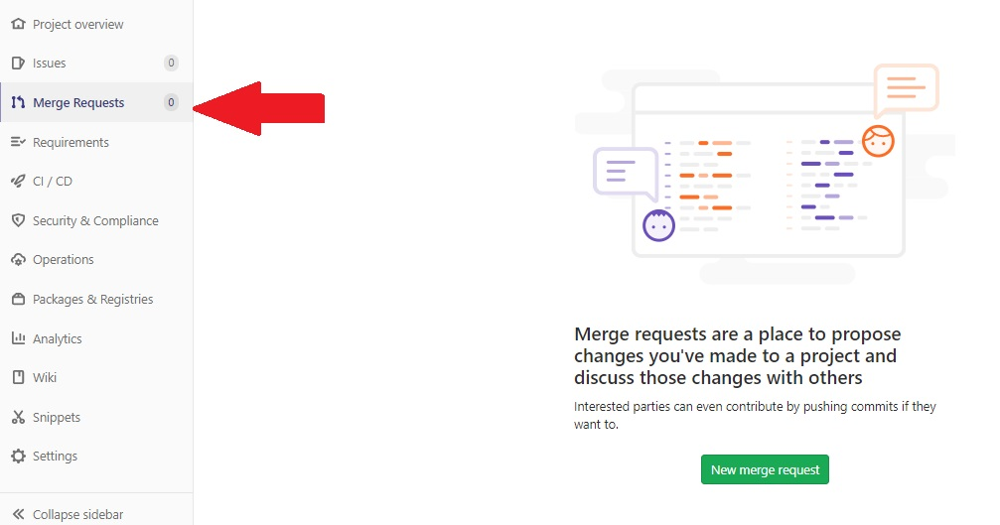
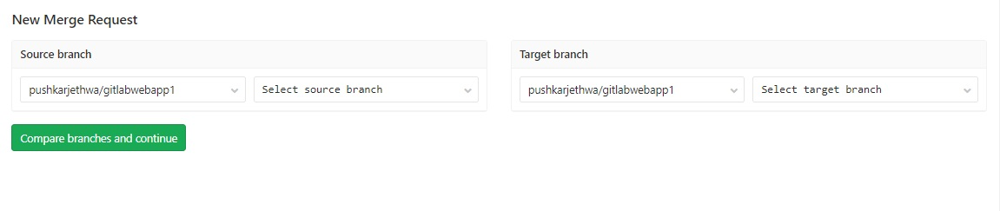
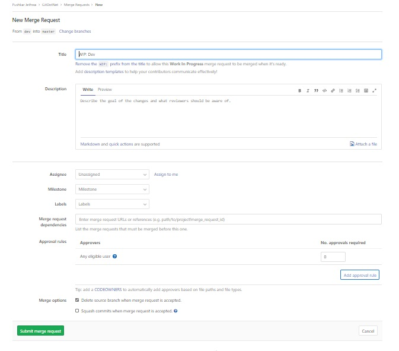

# Working with Branches

## Add GitIgnore File

- GoTo VSCode > Extension
- Search _GitIgnore Templates_
- Install Gitignore Templates By Hasan Ali
- After Installation, Press F1 Type _Gitignore file_ and select **Generate Gitignore file**
- Then Select VisualStudio from List of Options


## Create New Branch Dev based on Master

- Open Terminal at Project Location
- Check Existing Branch `git branch`
- Create New Branch `git branch dev`
- Set **Dev** as active Branch `git checkout dev`
- ---
- #### Make Changes to Active Branch
   1. Goto Project > Views > Home > Index.cshtml
   2. Delete Existing HTML Code
   3. Add
    ```html
        <h1>Welcome to GitLab DevOps</h1>
    ```
   4. Run 
    ```git
        git add .
        git commit -m "Dev Branch Changes - Modified HTML File"
        git push --set-upstream origin dev
    ```
---
- ### **Protect Branches**
- Disable _Push_ in Master and Dev Branch
- Go to GitLab Project Settings >> Repository
- Pass below Options in Protected Branch
  1. Branch : _dev_
  2. Allow to Merge : _Maintainers_
  3. Allow to Push : _No One_
  4. Click Protect
  5. **Repeat Same Activity for Master Branch**
  
  
    
---

### Create a Feature Branch

- Go to Terminal 
- Run 
  ```git
  git checkout dev
  git branch feature/feature001
  git checkout feature/feature001
  ```

- Make Changes to HTML File in Feature Branch
- Goto > Project > Views > Home > Index.cshtml
- Add
    ```html
    <h1>***Add Your Name Here**</h1>
    ```

- Run
  ```git
  git add .
  git commit -m "Feature  Branch"
  git push --set-upstream origin feature/feature001
  ```
---

### Merge Request

- Goto Gitlab Project > Merge Request

    

- Select New Merge Request
- In Source Branch Select _feature001_
- In Target Select _dev_
  
    

- Select Compare Branches and Continue
  
    

- Enter Title
- In Assignee - Click Assign to me
- Merge Options - Uncheck Delete Source Branch
- Click ***Submit Merge Request**