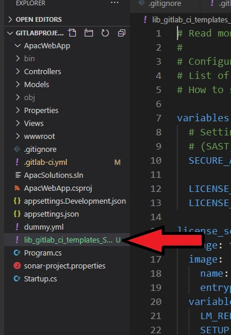

# Setup Native License Compliance in Existing Pipelines


## Setup Compliance Job

- Open `.gitlab-ci.yml` file in Project
- Add/Append below stage to yaml
  ```yaml
   stages:
     - test
  ```

## Download & Add Compliance Check file in Project

- Visit `https://gitlab.com/gitlab-org/gitlab/blob/master/lib/gitlab/ci/templates/Security/License-Scanning.gitlab-ci.yml`
- Download the FIle & Add to your project at root location
    

## Make changes in `.gitlab-ci.yml` CI File

- Open `.gitlab-ci.yml` file in Project 


