# Integrate SonarCloud in GitLab CI

## Task 1  : Create and Setup Sonar Cloud Account

- Goto www.sonarcloud.io
- SignIn **GitLab**

     

- Authorize
    
     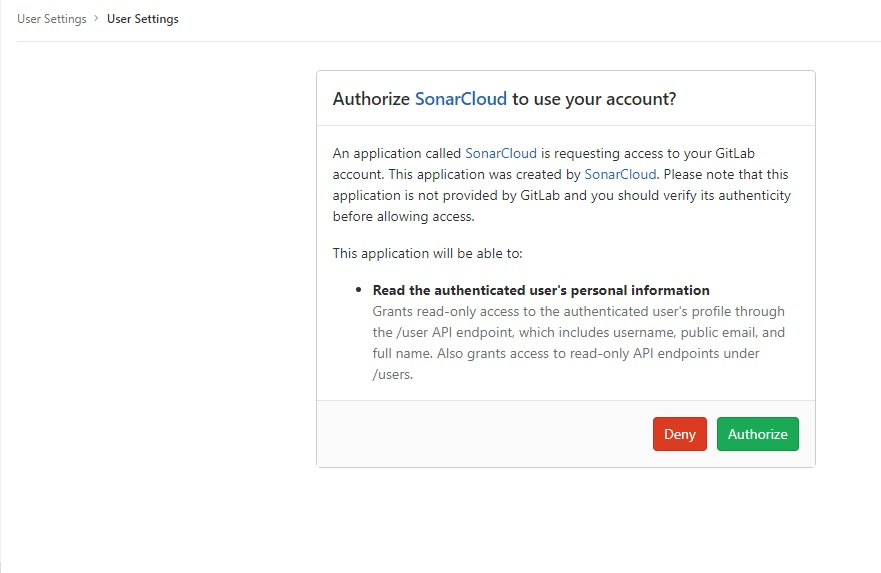

- Analyze your repo > Select Import projects from GitLab

     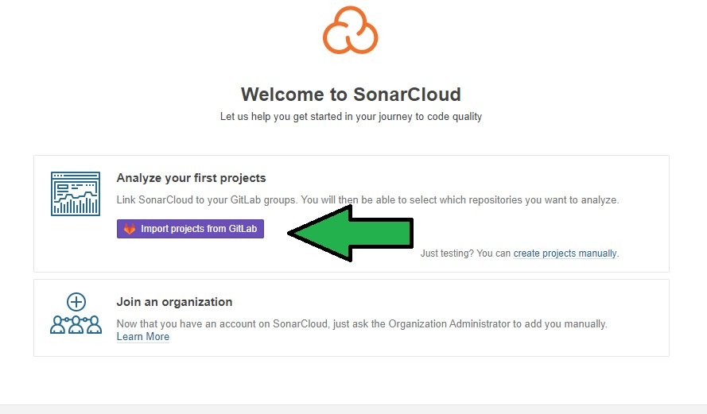 

- Create Organization

     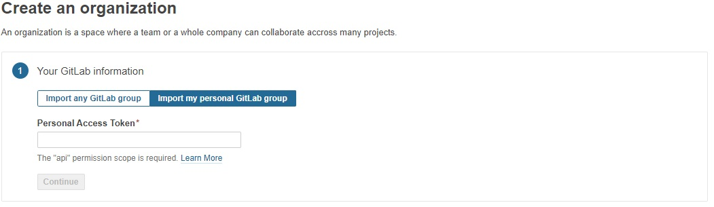

- Generate Access Token from GitLab with _api_ scope checked and enter here
  
     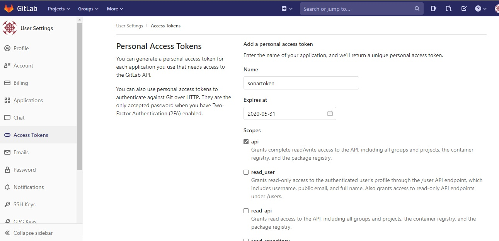

- Setup Organization name, Enter your name or Leave the default option shown

     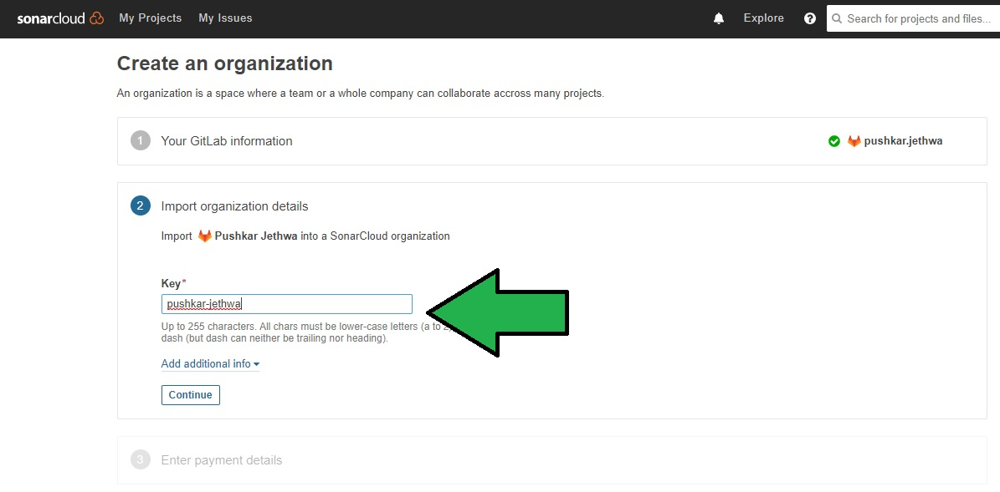

- In Next Page select free plan, if free plan in greyed out go to project settings in gitlab and make your project visibility public and save chnages

     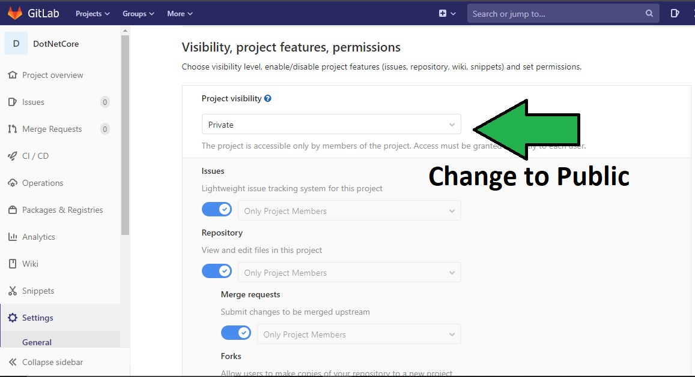
    
    - Refresh SonarCloud Page, select free plan and click create organization

     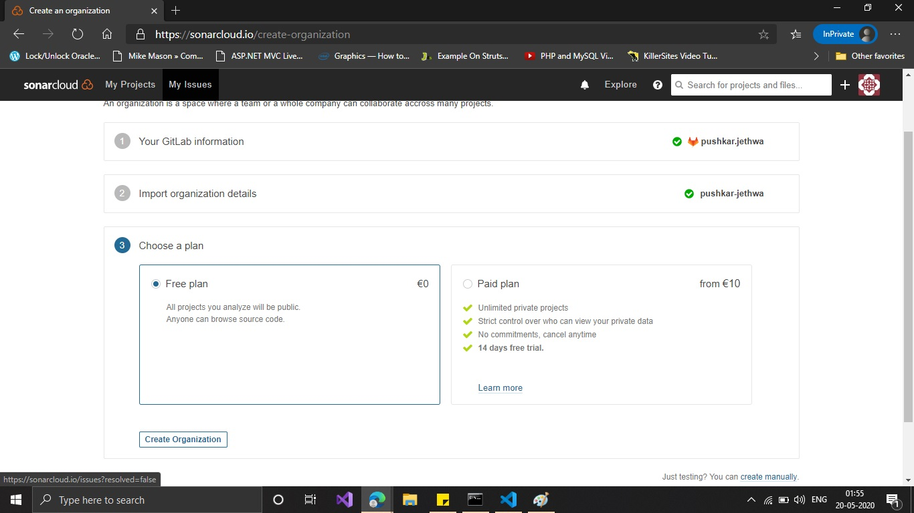

---
## Task 2 : Analyze Project

- Analyze new Project

     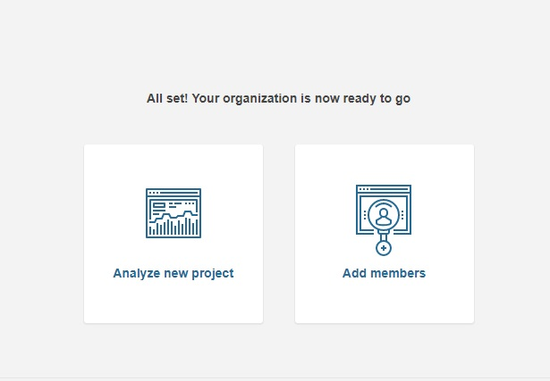

- Select Project You would like to Analyze

     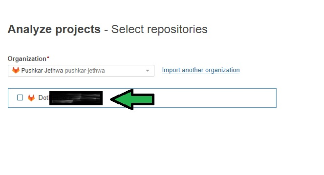

- Click _With Gitlab CI/CD Pipeline_ and follow the instruction show further

     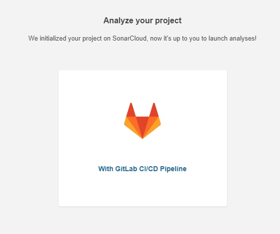

---
## Task 3 : Configure Gitlab and Project

- After you have configured Environment variables as directed by Instruction on Sonar Platform
- Select Other and copy paste the code snippet shown in your CI Pipeline file after the build job and click continue

     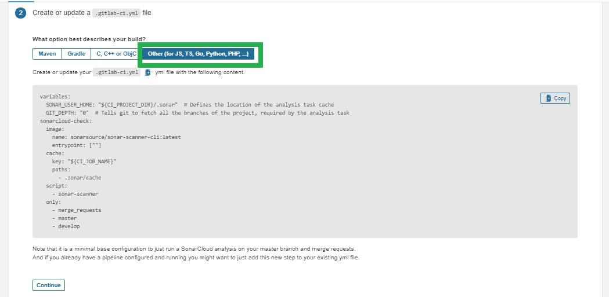

- Add `sonar-project.properties` file in your project in root location and code snippet shown as in Sonar Platform

     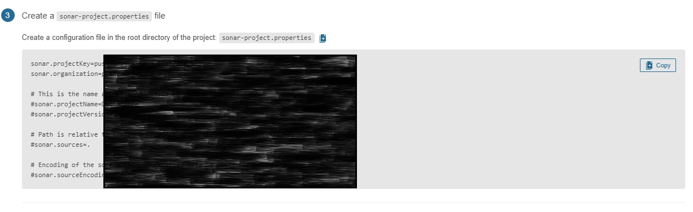
