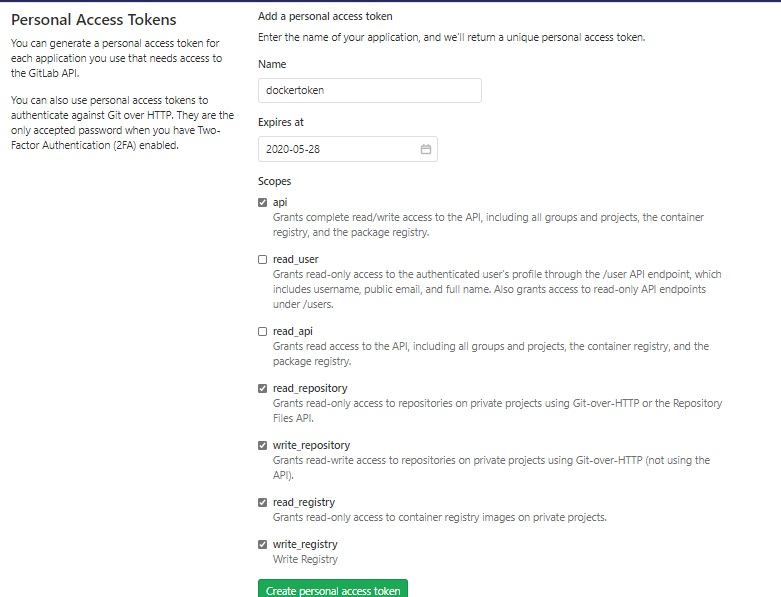
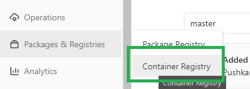
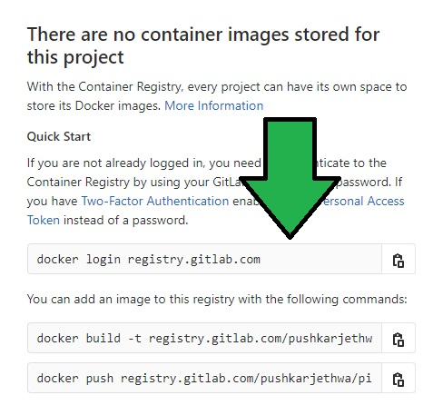

# Working with GitLab Container Registry

## Task 1 : Dockerize your application

- Open Project in VSCode
- Add new file `Dockerfile` in root location
- Add below code snippet in docker file and replace project name values 
  ```docker
  FROM mcr.microsoft.com/dotnet/core/sdk:3.1 AS build-env
  WORKDIR /app

  # Copy csproj and restore as distinct layers
  COPY *.csproj ./
  RUN dotnet restore

  # Copy everything else and build
  COPY . ./
  RUN dotnet publish GitLabWebApp.csproj -c Release -o out

  # Build runtime image
  FROM mcr.microsoft.com/dotnet/core/aspnet:3.1
  WORKDIR /app
  COPY --from=build-env /app/out .
  ENTRYPOINT ["dotnet", "GitLabWebApp.dll"]
  ```

## Task 3 : Create Access Token

- Goto User Settings and create new Access Token by name `dockertoken` with _api, read_repository, write_repository_ scoped checked
    

- Note Token Value

## Task 3 : Add Docker Build Jobs in Pipeline

- Add below code snippet in `.gitlab-ci.yml`
  ```yaml
  createdockerimage:
  stage: dockerbuild
  image: docker:stable
  services:
   - docker:dind
  script:
      - export DOCKER_HOST=tcp://docker:2375/
      - docker login -u dockertoken -p <Enter token value here> registry.gitlab.com
      - docker build -t registry.gitlab.com/pushkarjethwa/gitlabwebapp .
      - docker push registry.gitlab.com/pushkarjethwa/gitlabwebapp
  ```

- Perform below activities in Docker Build Jon in Pipeline
  - Replace Token Value in docker login command
  - Navigate to Project > Package & Registry > Container Registry
    
    
  - Note commands as shown in Page
   
    
  
  - Replace registry url in docker build & docker push task

- Save file, Commit and Push Changes
- Navigate to Pipeline and Check Pipeline execution