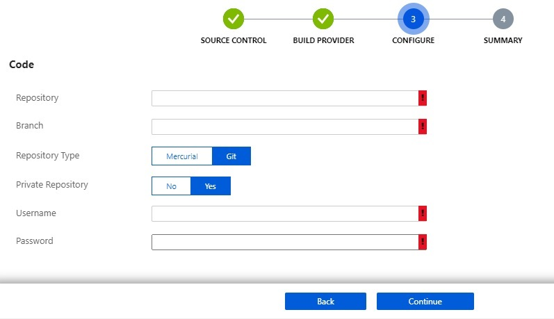

# Continuous Deployment to Azure WebApp

- Login To Azure
- Open `shell.azure.com`
- Run 
  ```cmd
  >> az group create -n europe<initials> -l eastus
  >> az appservice plan create -n freeplan<initials> -g europe<initials> --sku F1
  >> az webapp create -n clwebapp<add name initials> -g europe<initials> -p freeplan<initials>
  ```
- Goto Azure Portal > App Services > Select App Service created in previous step
- Goto **Deployment Center** in App Service
- In Source Control _Select External_
- In Build Provider _Select Kudu App Service Build_
- In Repository, fill Fields
  
  

- Click Continue