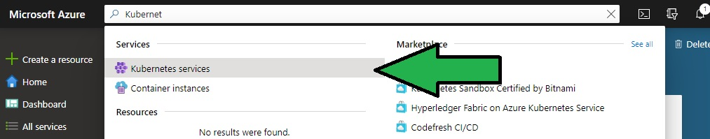
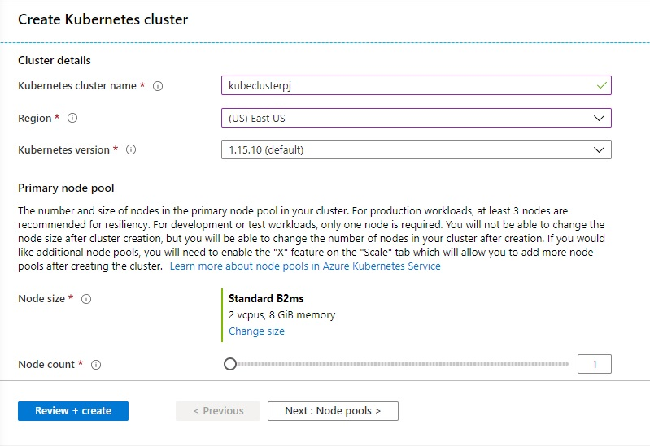
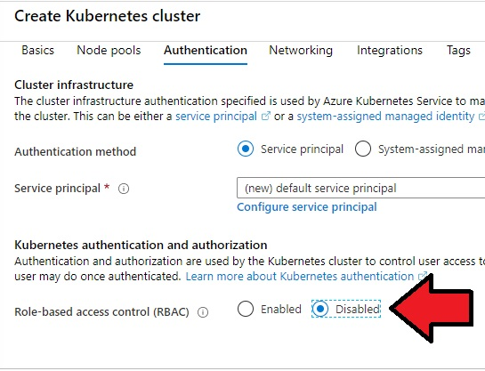

# Create Kubernetes Cluster on Azure & Deploy Container Image via GitLab

## Task 1: Create Kubernetes Cluster on Azure

- Goto `portal.azure.com`
- Search Kubernetes Services
  
  

- Click Add
- In Create Kubernetes Cluster Page enter below details
    - Resource Group: _(YourName)_
    - Kubernetes Cluster Name: _kubecluster-(your initials)_
    - Region: _East US_
    - Version : _Default_
    - Node Size : _Standard B2ms_
    - Node Count : 1

    

- Next **Node Pools**
  - Virtual Nodes : Disabled
  - VM Scale Sets : Disabled
- Next **Authentication*
  - Role based Access control : Disabled
    
    

- Next **Networking** Nothing to changes
- Next **Integrations**
  - Disable Container Monitoring

- Click Review + Create 
- After Validation Passes, Click Create 