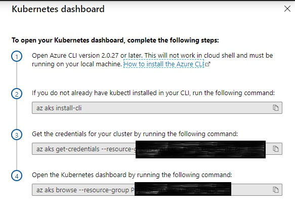
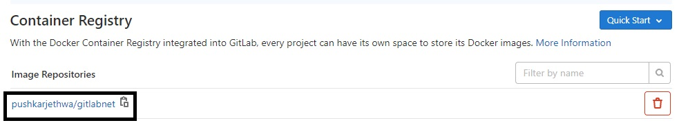
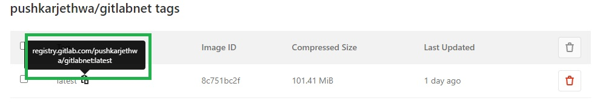
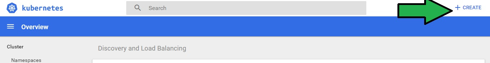
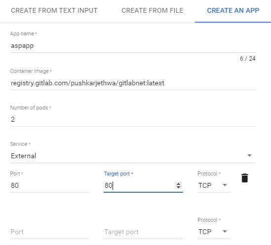
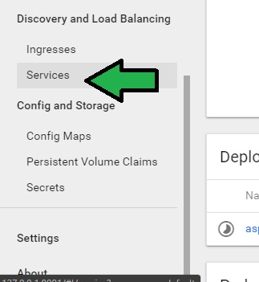
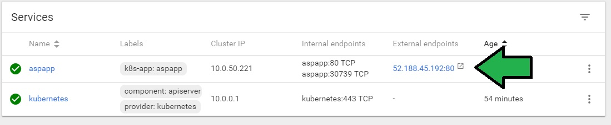

# Create Kubernetes Cluster on Azure & Deploy Container Image via GitLab

## Task 1: Create Kubernetes Cluster on Azure

- Goto `portal.azure.com`
- Search Kubernetes Services
  
  

- Click Add
- In Create Kubernetes Cluster Page enter below details
    - Resource Group: _(YourName)_
    - Kubernetes Cluster Name: _kubecluster-(your initials)_
    - Region: _East US_
    - Version : _Default_
    - Node Size : _Standard B2ms_
    - Node Count : 1

    

- Next **Node Pools**
  - Virtual Nodes : Disabled
  - VM Scale Sets : Disabled
- Next **Authentication*
  - Role based Access control : Disabled
    
    

- Next **Networking** Nothing to changes
- Next **Integrations**
  - Disable Container Monitoring

- Click Review + Create 
- After Validation Passes, Click Create 

## Connect to Cluster

- Goto Kubernetes Cluster you have Created
- Click View Dashboard Tile in Overview Page
  
  
- Follow the Instruction as shown 
- After Running all commands you will connect to Cluster and it will take you to Cluster Landing page

    

---
## Task 2 : Deploy Container Images in Cluster

- Goto Gitlab Project > Package & Registry > Container Registries
- Select the Image Repository Shown
  
  
- Copy the registry url
  
  

- Goto to Kubernetes Cluster and Click Create button
  
  

- Click Create and App Tab
- ENter Detail as shown
  
  

    - Note: _Enter Registry Url copied from GitLab in Container Image_

- Click Deploy
- Goto Services
  
  

- Note External IP and enter in Web Browser
  
  