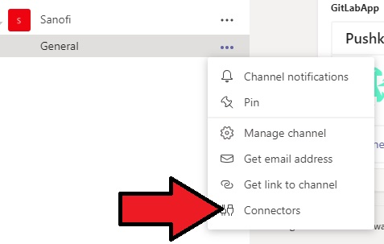
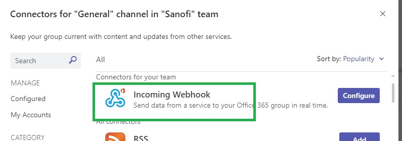
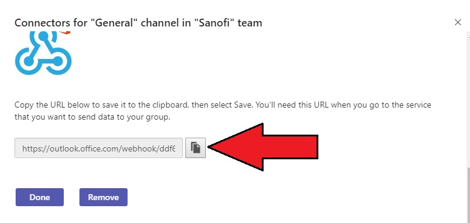
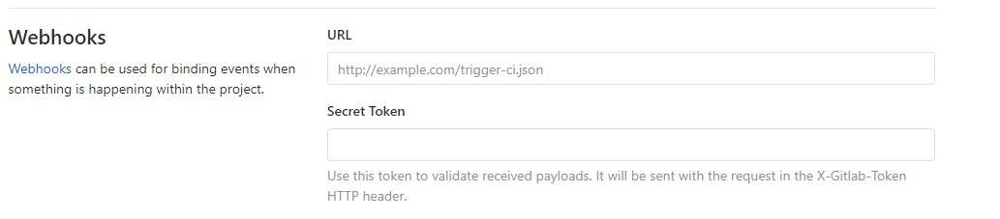

# Microsoft Teams Integration

## Task 1 : Create Outlook WebHook

- Open MS Teams and Create New Team **Sanofi**
- In Sanofi > General > Connectors

    

- Search WebHook adn Configure InComing Webhook
  
    

- Enter Webhook Name and Click Create
- Note WebHook Url
  
  

---
## Task 2 : Register Webhook with Gitlab

- Goto GitLab Project > Settings > Webhooks
- Enter Webhook Url Copied from MS Teams. Leave Secret Token Empty
  
  

- Select _Push Events_, _Pipeline Events_ and click **Add WebHook**